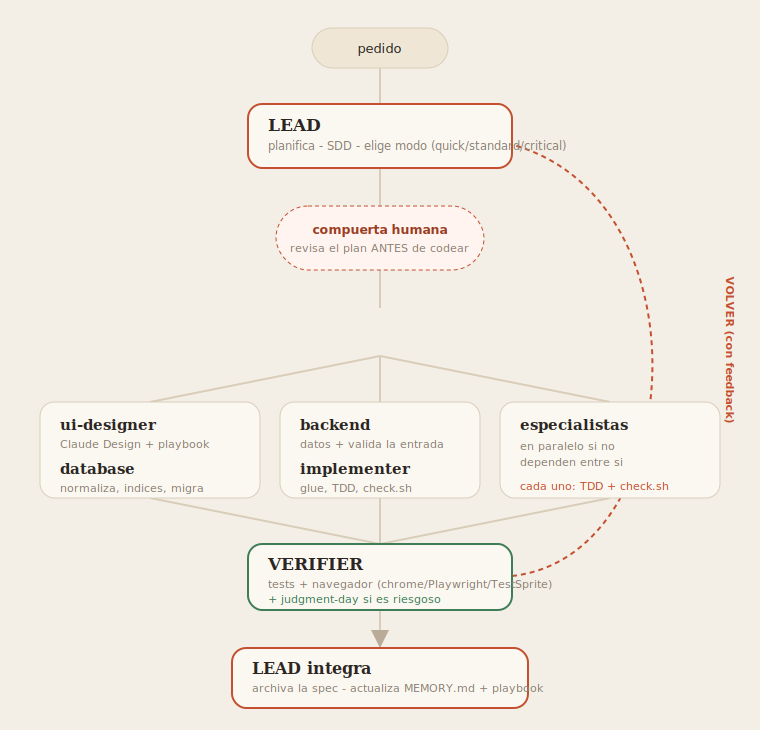

# ai-harness

Un **harness** mínimo y reutilizable para trabajar con agentes de IA en cualquier proyecto.
Clonas esto, completas 2 archivos (o lo adoptas en un repo existente), y arrancas con un
**equipo de agentes especialistas** en vez de un solo agente haciendo todo y yéndose de las
manos. Cada especialista acumula best practices en su playbook, asi el proximo proyecto
arranca mejor.

## Que es un harness

El "código" alrededor del modelo: las reglas, la memoria, los roles, las herramientas y el
loop de verificación que hacen que un agente trabaje bien y de forma repetible. El modelo es
el motor; el harness es el chasis, la dirección y los frenos.

## El flujo



> Version animada (anime.js): abri [`docs/flow.html`](docs/flow.html) en el navegador.

**Loop controlado, no "goal mode".** La IA es probabilística: una cadena larga de "anda y
hace todo" deriva. El harness trabaja en **fases con compuertas** (SDD: proposal -> design ->
tasks -> revision humana -> apply con TDD -> verify -> archive). Autonomía acotada, no un
cheque en blanco. Mas barato, mas predecible, menos alucinación.

## Que trae

```
AGENTS.md             Contrato de trabajo (lean, max 500 lineas). Como trabajamos. Portable.
CLAUDE.md             Puntero a AGENTS.md.
project.yml           Datos del proyecto: stack, comandos, convenciones. Lo completas vos.
init.sh               Instala tools (codebase-memory, markitdown, MCPs) y prepara carpetas.
.claude/agents/       Roles: lead, ui-designer, database, backend, implementer, verifier.
.claude/settings.json Hook que mantiene el skill registry sincronizado.
memory/MEMORY.md      Memoria persistente entre sesiones.
memory/playbooks/     Best practices por disciplina (ui/backend/db/lead). Crecen con el uso.
skills/               Skills cargadas por necesidad + REGISTRY.md.
openspec/             Specs vivientes (specs/) y cambios (changes/<id>/) del flujo SDD.
work/                 Salida de cada tarea: plan, hallazgos, veredictos.
docs/                 flow.svg / flow.html + docs externas (markitdown).
scripts/              Las herramientas (ver abajo).
.mcp.json             Servidores MCP (lo crea init.sh).
```

### Skills (en `skills/`, cargadas por necesidad)
`sdd` (loop controlado) - `tdd` (test primero) - `judgment-day` (dos jueces para lo riesgoso)
- `adopt` (onboarding brownfield) - `migrate` (adoptar + limpiar un proyecto vivo).

### Scripts (en `scripts/`)
- `check-dep.sh` - ultima version estable + deprecacion + vulnerabilidades (OSV) antes de un paquete.
- `check.sh` - el implementer lo corre al terminar: format, lint, build, secretos, audit.
- `doctor.sh` - audita la salud del harness (placeholders, registry, playbooks viejos).
- `adopt.sh` - autodetecta stack/comandos de un proyecto existente.
- `strip-comments.sh` - quita comentarios con AST (.py tokenize, .ts/.tsx compilador TS).
- `ascii.sh` - pasa la prosa a ASCII (em/en dash, comillas, flechas), mantiene acentos.
- `spell.sh` - ortografia espaniol+ingles (cspell + dict es-es). Corre al final de `check.sh`.
- `skill-sync.sh` - regenera `skills/REGISTRY.md`.

## Como usarlo en un proyecto nuevo

```bash
git clone https://github.com/padawanpy7/ai-harness.git   # o copialo dentro del repo
./init.sh                                                 # tools + carpetas (+ rellena project.yml si es interactivo)
# completas project.yml + los {{PLACEHOLDERS}} de AGENTS.md (1 y 8)
# abris el repo con Claude Code y pedis: "arranca como lead"
```

## Adoptar el harness en un proyecto YA existente (brownfield)

```bash
# copias el harness dentro del repo, después:
bash scripts/adopt.sh              # autodetecta stack y comandos -> project.yml
# y al agente:
"revisa el proyecto y completa el harness para seguir el desarrollo (skill adopt)"
./init.sh                          # deja las tools operativas (codebase-memory, markitdown, MCPs)
bash scripts/doctor.sh             # confirma que quedo sano
```

El agente infiere convenciones, **carga los playbooks desde el código real** (sistema de
diseño, forma de la API, esquema de BD) y reverse-engineea las capabilities a
`openspec/specs/`. Para un proyecto vivo con limpieza de por medio (quitar comentarios,
checks), usa el skill `migrate` (baseline -> adopt -> limpiar -> verify, sin romper).

## Escala la ceremonia (modos)

No todo paga el mismo proceso. El lead elige: **quick** (fix trivial, sin SDD ni compuerta),
**standard** (feature: SDD + TDD + verifier), **critical** (riesgo: + judgment-day). Asi lo
trivial es rapido y lo riesgoso va con todo. `scripts/doctor.sh` mantiene los docs sin pudrir.

## Herramientas externas

- **codebase-memory-mcp** (obligatorio) - grafo del código para entender antes de tocar.
- **Context7** - docs de librerias al dia (no las viejas que recuerda el modelo).
- **markitdown** - convierte PDF/Office/imagenes a markdown.
- **chrome-devtools MCP / Playwright / TestSprite** - el verifier opera la app real.

Ver `AGENTS.md` para el detalle de como se usan y por que (incluye Seguridad y las reglas
de no-comentarios, versiones y ASCII).
